# Setting Up

## 0. Overview

1. Download Git
2. Setup GitHub account
3. Accepting GitHub Assignment
4. Clone to your computer
5. Saving and uploading changes

## 1. Download Git

> **Skippable**
> Before you start, check whether you have `git` already installed using your terminal
>
> ```
> git --version
> ```
>
> If you see a version number (e.g. `git version 2.47.1.windows.1`) then you already have git and can skip this step
>
> Otherwise, if you see an error that `git` is not a command (e.g. `'git' is not recognized as an internal or external command`), then you need to follow the instructions

### 1.1 Installing Git

1. Go to git's download page: https://git-scm.com/downloads
2. Download the installer and install git into your computer.
3. Go ahead and select all the default options.
4. You can omit the installation of any additional software.

Once you have downloaded Git, use your a new terminal/command prompt to double check the installation

```
git --version
```

### 1.2 Configuring Git

You should now see a version number (e.g. `git version 2.47.1.windows.1`)

Thereafter, set up the following information using the terminal/command prompt.

**Your name**

```
git config --global user.name "YOUR NAME"
```

and

**Email**

> You can use your ichat email address

```
git config --global user.email "YOUR_EMAIL"
```

## 2. Setting up GitHub account

> If you previously already have a GitHub account, you can also skip this step.

1. Go to: http://github.com/signup and sign up for an account.
2. You can use your ichat email address.
3. You can choose any username.

## 3. Accepting GitHub Assignment

You should receive a Github Assignment link by your tutor. Click on the link to accept the assignment.

Once you clicked on the link you will need to do the following:

1. (first time only) Select your name
    1. If you do not see your name, go ahead and skip the step and inform your tutor.
    - 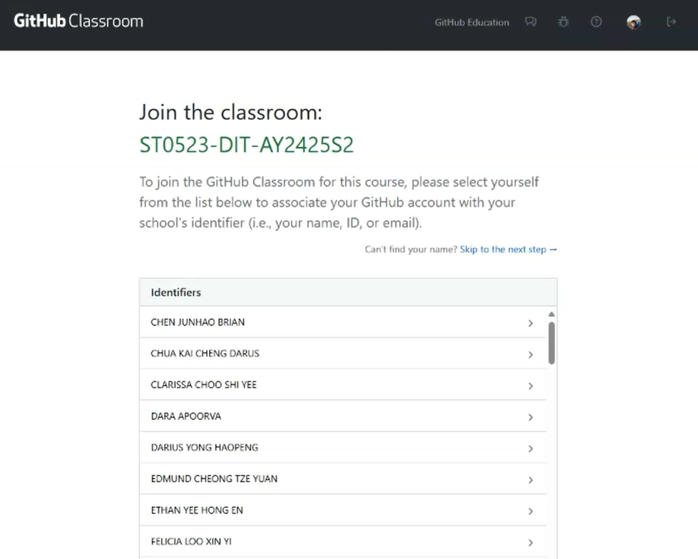
2. Accept the assignment and wait for it to generate
    - 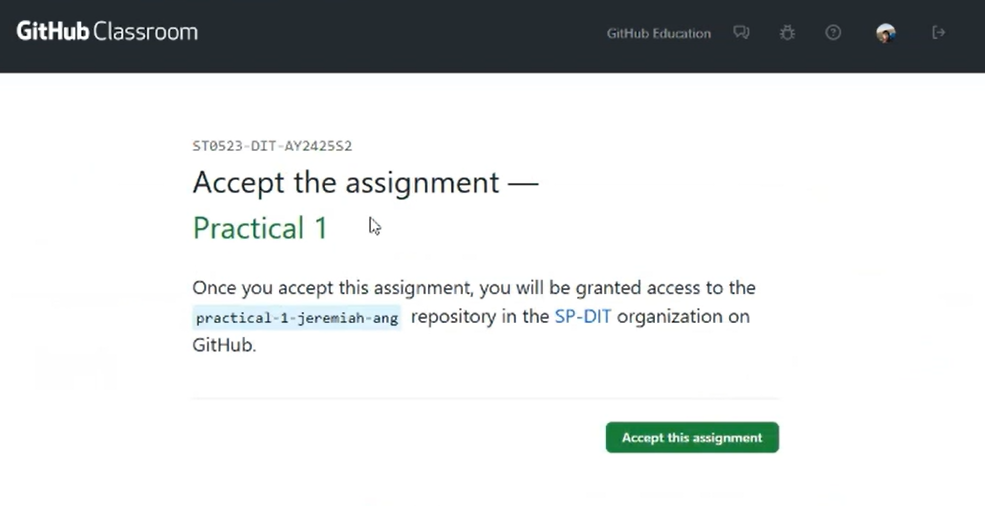
3. Click on the assignment link, it should be a link that contains the name of the practical and your username (e.g. `www.github.com/practical-1-john-doe`)
    - 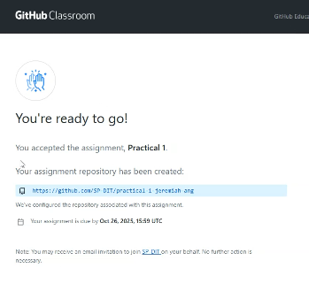
4. Click on the generated link and you should see the files on GitHub.
    - 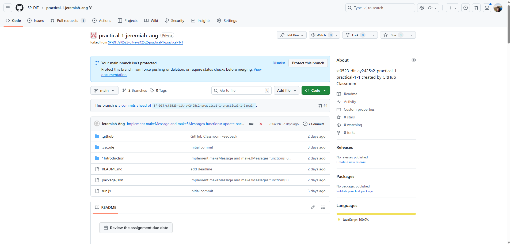

## 4. Clone to your computer

We will not be editing the files on GitHub directly, but instead, you will _clone_ to your computer and make your changes on your computer using VS Code.

> _Clone_ and _Download as zip_ is 2 different things, do not _Download as zip_.
>
> Tldr: _Clone_ makes a copy while tracking history, whereas _Download as zip_ does not track history.

1. Open up your VSCode
2. Use `CTRL + SHIFT + P` to open the command palette (You should see a `>` at the start of the textbox)
    - 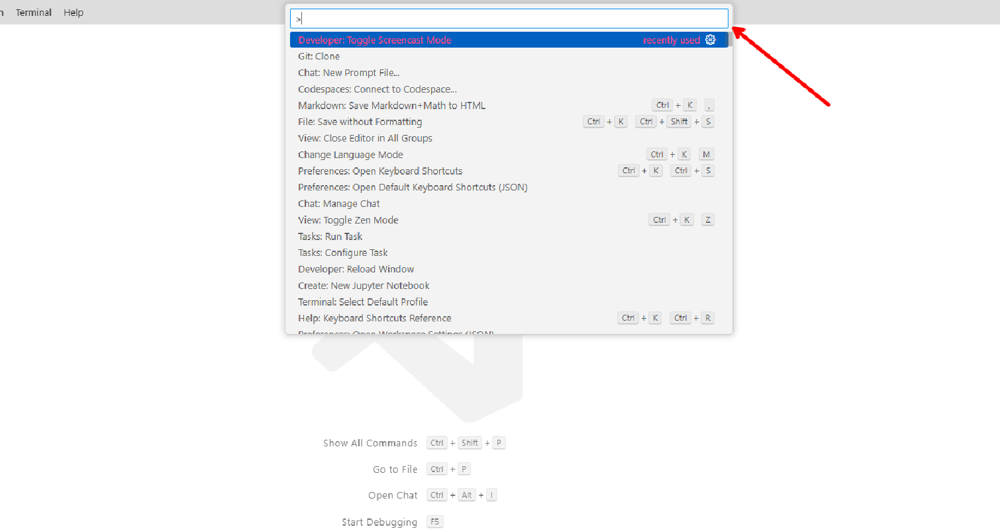
3. Enter `git:clone` and select the corresponding option.
    - 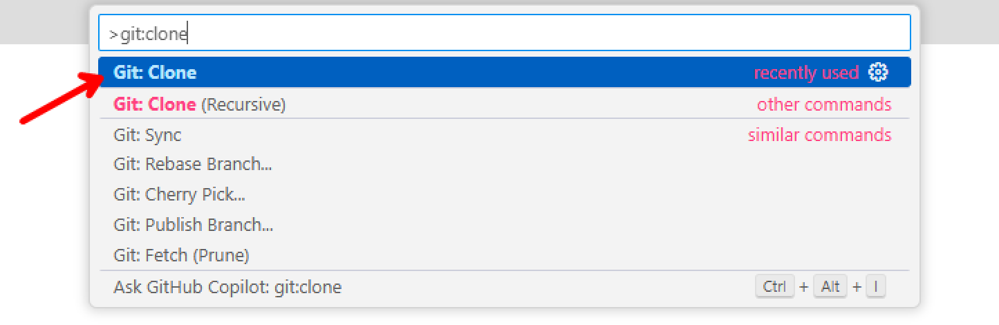
4. Copy and paste your code's url (e.g. `www.github.com/practical-1-john-doe`)
    - 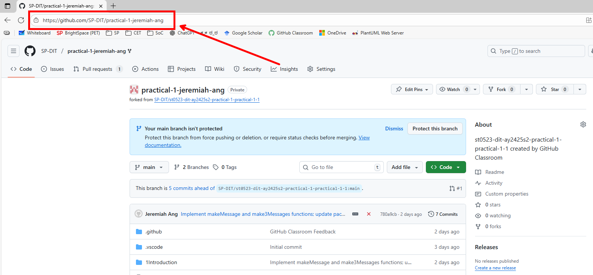
5. Select `Clone for URL`.
    - 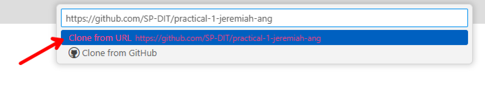
6. (First time only) You may need to login to VSCode with your GitHub account first.
    - 
7. Select the destination that you want to save the files to.
8. Once it is cloned, open with VSCode

## 5. Saving and uploading changes

Once you have cloned the repository, go ahead and make some changes (e.g. try solving q1)

Once you have made some changes, you can go ahead and save and upload the changes by following the steps:

1. Save as per usual (`CTRL + S`)
2. Click on the Source Control icon or click (`CTRL + SHIFT + G`)
    - 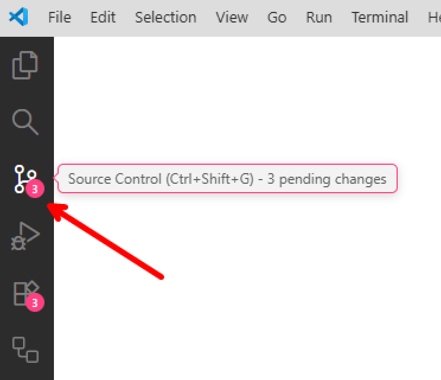
3. Type a summary message (e.g. "Complete q1") or click on the `sparkle`(✨) to use AI to generate a message.
    - 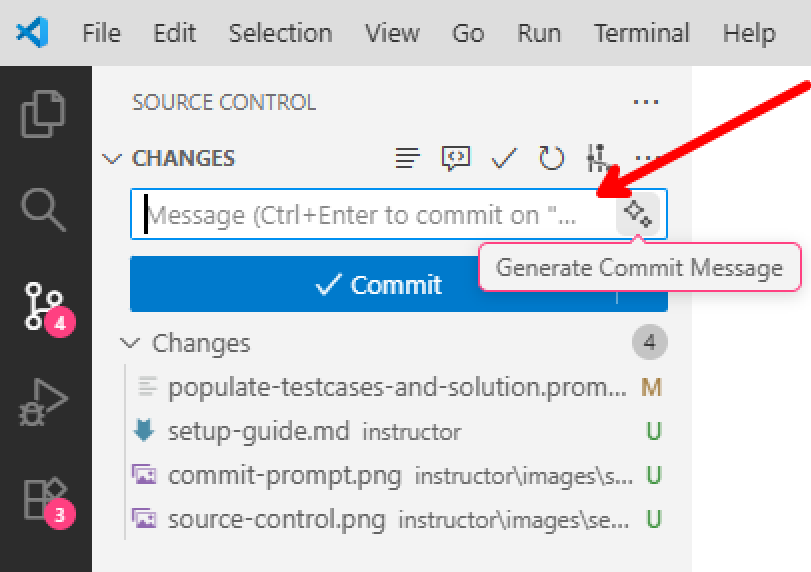
4. Click on the `✓ Commit` button. If a pop up appears, click "Yes" or "Save all and commit changes".
    - 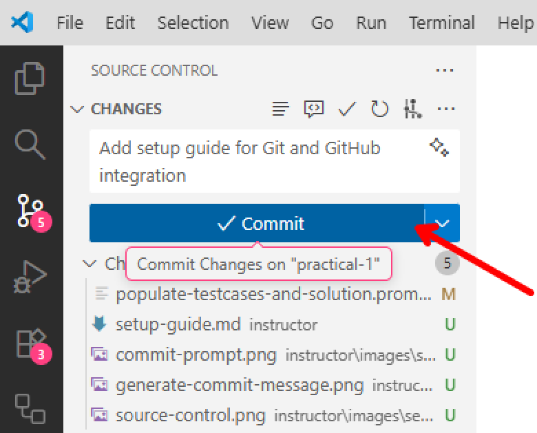
    - 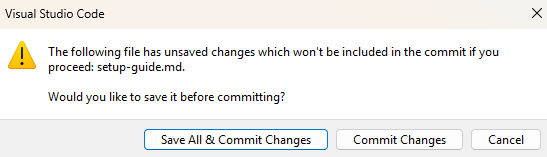
    - 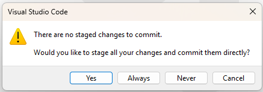
5. Click on the `⟳ Sync` button to upload your changes. Once sync-ed you should see the changes back on the github page.
    - 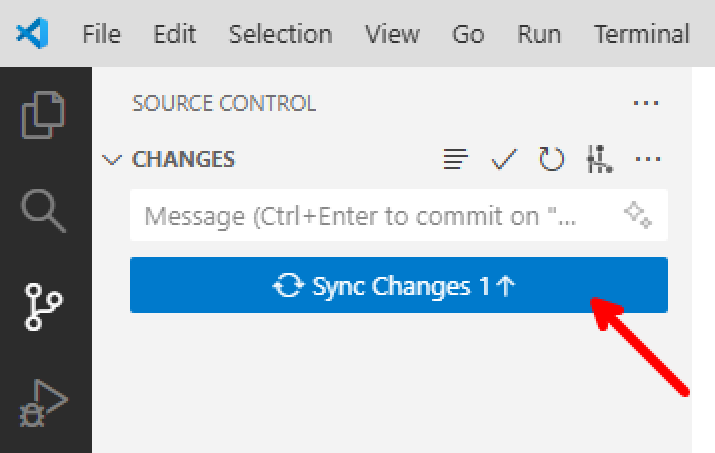

That's it! Now try completing the remaining question and repeat the steps again.

## When stuck

1. Consult your tutor on MS Teams for more help.
